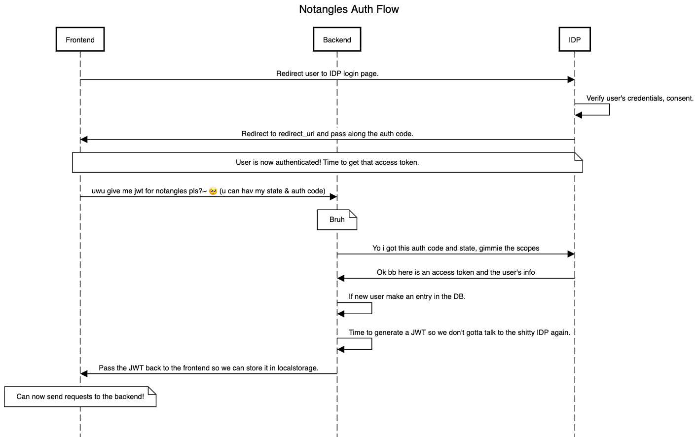

# Notangles Server 💯

The Notangles server allows the client to communicate with the database and the autotimetabling server.

## Installation

- npm v8.8.0
- node v18.1.0

In the root server directory `server`, run `npm install` to install all the dependencies.

## Running

First, make sure you have started Docker via Docker Desktop on your machine. Then, run `docker-compose up` to start the server locally. The server will be hosted at http://localhost:3001.

Whenever changes are made to any of the Typescript files, make sure to kill the current running instance and run `docker-compose up --build` to rebuild the corresponding Javascript files and restart the server.

To visually inspect the database, install [MongoDB Compass](https://www.mongodb.com/products/compass) and connect to `mongo://localhost:27017`.

## Tech Stack

The Notangles server uses:

- [Nest.js](https://nestjs.com/)
- [MongoDB](https://www.mongodb.com/)
- [Mongoose](https://mongoosejs.com/)

## Stuff to know

- Nest.js is basically what Django is to Python. Like a thicc-er version of Express.
- Nest has 3 main types of files:
  - [Controller](https://docs.nestjs.com/controllers)
  - [Service (which are a type of Provider)](https://docs.nestjs.com/providers)
  - [Module](https://docs.nestjs.com/modules)
- We have 3 main modules, each containing at least 1 of each of the above types of files.
  - `src/sum` (The example one to look at if you haven't used Nest before.)
  - `src/auth` (Handles authentication with our )
  - `src/auto` (Handles auto-timetabling)

## Auth Module

The auth module handles authentication with our backend.
We use a OAuth2.0 flow to authenticate with Google, and access the user's profile via OpenID.

This pretty much consists of redirecting the user to /auth/login, which will redirect the user to Google's login page.
Google takes over, then redirects the user to where we tell them (which will be the frontend but we haven't set that up yet).
When the user gets redirected back to our frontend, the query parameters will include a `code` and `state` parameter which we process on the frontend.
From the frontend, we then make a request to the backend to exchange the `code` for an access token.

With the above steps we have completed authentication with Google, and we can now make requests to the backend.
By making a request to /auth/token we can get a JWT token which we can use to make authenticated requests to our backend, as well as some user info.
This is the main token we will be using in the future, so it should be stored in local storage.

For more details on the auth module, see the below sequence diagram and refer to the logic of the example frontend inside of the `auth-tester` folder in this repo.

[)

## Environment variables required

Please check the Vault for the contents of the `.env` file and copy it into a file called `.env` in `/server`. Without these environment variables, the server will not run.
